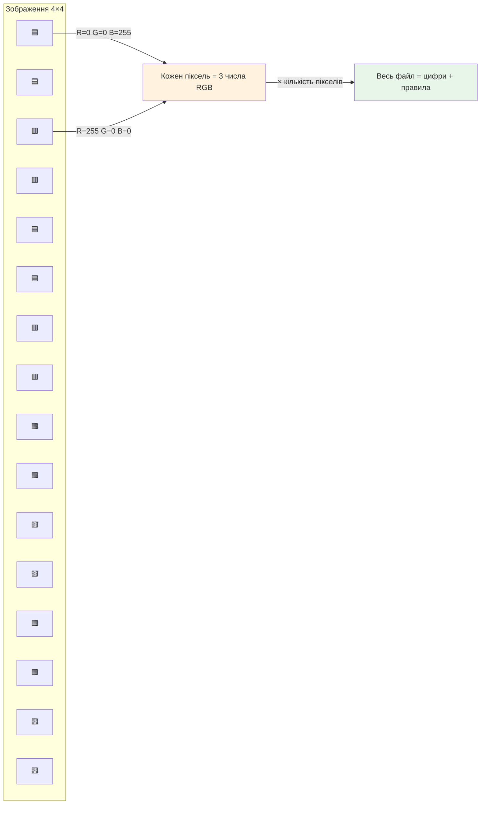
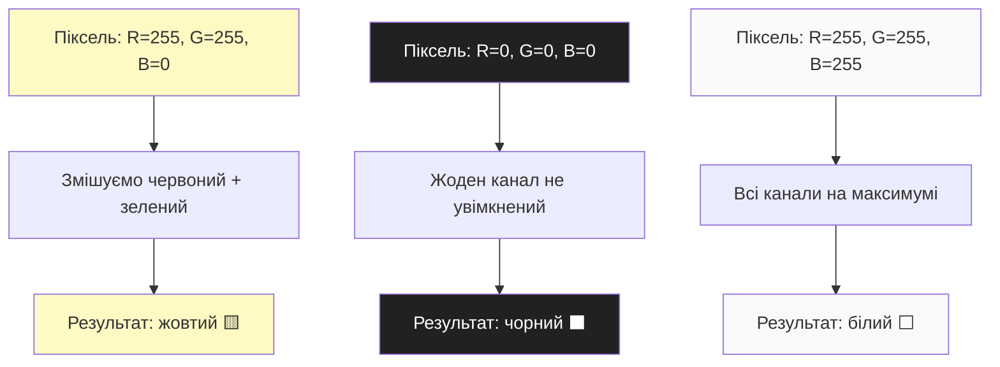

# Лекція 5. Як комп’ютер бачить картинки

> **Рівень 1: Мисливець за даними**
>
> Марко, сьогодні ми не просто вивчимо новий термін — ми відкриємо ще один шар того, як насправді працює комп’ютер.

## Що ми сьогодні розкриємо

- зрозуміти, що таке піксель
- познайомитися з RGB та роздільною здатністю
- оцінювати, чому зображення потребують багато даних

## Картинка як мозаїка

Підійди дуже близько до екрана або сильно збільш фотографію. Ти побачиш маленькі квадратики — **пікселі**. Цифрове растрове зображення можна уявити як величезну таблицю, де для кожної клітинки записано колір.

Наприклад, картинка 800×600 має 480 000 пікселів. Уже майже пів мільйона маленьких кольорових «цеглинок».



## RGB — колір як три числа

Екран часто створює колір, змішуючи **R**ed, **G**reen і **B**lue. Простий варіант запису використовує для кожного каналу числа від 0 до 255.

```text
(255, 0, 0)   червоний
(0, 255, 0)   зелений
(0, 0, 255)   синій
(255,255,255) білий
(0,0,0)       чорний
```

255 тут не випадкове: один байт має 256 можливих значень — від 0 до 255.



## Роздільна здатність і розмір даних

Чим більше пікселів, тим більше даних треба зберегти. Якщо дуже грубо уявити RGB-картинку без стиснення як 3 байти на піксель, то 1920×1080 потребує понад 6 мільйонів байтів лише для кольорів одного кадру.

Реальні формати PNG і JPEG використовують додаткові правила та стиснення, тому розмір файлу не дорівнює просто `ширина × висота × 3`. Але така оцінка добре показує масштаб.

## Приклади

### Приклад 1

Піксель `(255, 255, 0)` має максимум червоного й зеленого та нуль синього — виходить жовтий.

### Приклад 2

Картинка 10×10 — це лише 100 пікселів. Її можна буквально уявити як маленьку таблицю чисел.

### Приклад 3

Зображення 4000×3000 має 12 000 000 пікселів — тому фотографія з камери містить дуже багато початкових даних.

## Python-лабораторія: створюємо PPM-картинку без бібліотек

Формат PPM дуже простий і чудово підходить для експерименту. Створи `pixel_art.py`:

```python
width = 4
height = 4

pixels = [
    [(255,0,0), (255,0,0), (0,0,255), (0,0,255)],
    [(255,0,0), (255,0,0), (0,0,255), (0,0,255)],
    [(0,255,0), (0,255,0), (255,255,0), (255,255,0)],
    [(0,255,0), (0,255,0), (255,255,0), (255,255,0)],
]

with open("pixels.ppm", "w") as f:
    f.write("P3
")
    f.write(f"{width} {height}
")
    f.write("255
")
    for row in pixels:
        for r, g, b in row:
            f.write(f"{r} {g} {b} ")
        f.write("
")
```

Відкрий `pixels.ppm` у програмі перегляду зображень. Ти власноруч створив картинку просто числами.

## Місія для Марка

Виконай місію по черзі. Якщо щось не виходить — спочатку перечитай приклад вище й спробуй знайти, на якому кроці результат відрізняється.

1. запусти `pixel_art.py` і відкрий результат
2. зміни один синій піксель на білий `(255,255,255)`
3. створи власний візерунок 4×4 хоча б із трьох кольорів
4. порахуй кількість пікселів у зображеннях 100×100 та 1920×1080
5. поясни, чому число 255 часто зустрічається у RGB

## Перевір себе

- Що таке піксель?
- Що означають три числа RGB?
- Скільки пікселів у картинці 20×30?
- Чому більша роздільна здатність зазвичай означає більше даних?
- Чи дорівнює розмір JPEG-файлу просто кількості пікселів × 3?

## Що потрібно винести з лекції

- растрове зображення — це сітка пікселів
- колір пікселя можна представити числами, наприклад RGB
- розмір і якість зображення пов’язані з кількістю пікселів та способом кодування

---

**Хакерський принцип:** не запам’ятовуй магічні слова. Намагайся пояснити своїми словами, що відбулося і чому.
