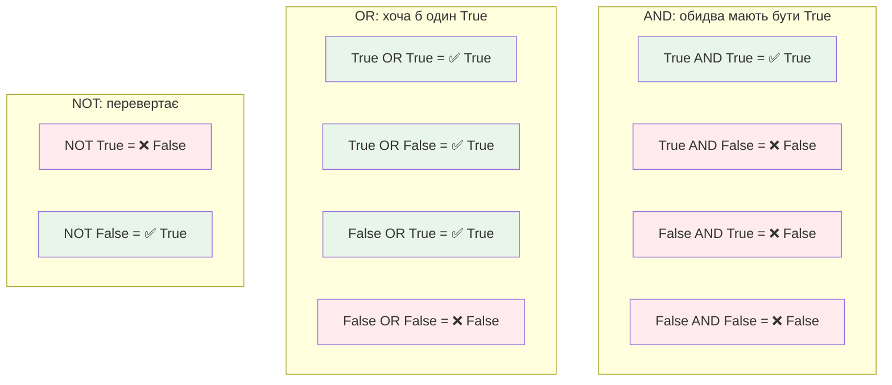

# Лекція 9. Логіка комп’ютера: True, False, AND, OR, NOT

> **Рівень 2: Архітектор логіки**
>
> Марко, сьогодні ми не просто вивчимо новий термін — ми відкриємо ще один шар того, як насправді працює комп’ютер.

## Що ми сьогодні розкриємо

- працювати з логічними значеннями
- розуміти AND, OR і NOT на життєвих прикладах
- будувати складні умови у Python

## Зв’язок з попередніми лекціями

У цій лекції ми використаємо поняття програми та інструкції з лекції 8, щоб навчитися керувати роботою програми за допомогою умов.

## Логічне значення відповідає на питання «так чи ні»

У Python є тип `bool` із двома значеннями: `True` і `False`. Наприклад, результат `7 > 3` — `True`, а `2 == 5` — `False`.

Це схоже на один біт за ідеєю «два стани», але не треба плутати рівні: Python-об’єкт `True` — це високорівневе значення мови, а біт — одиниця цифрових даних.

## AND, OR і NOT — правила комбінування відповідей

**AND** істинне, коли істинні обидві умови. **OR** — коли істинна хоча б одна. **NOT** перевертає відповідь.

```text
є_квиток AND двері_відчинені → можна зайти
дощ OR сніг                 → потрібна куртка
NOT світло_увімкнене        → світло вимкнене
```

### Таблиці істинності



## Логіка керує рішеннями програм

Умови дозволяють програмі обирати шлях. Наприклад, гра може дозволити відкрити скриню лише якщо `has_key and level >= 5`. Так прості логічні шматочки створюють складну поведінку.

## Приклади

### Приклад 1

`age >= 9 and age <= 12` перевіряє, чи число лежить між 9 і 12 включно.

### Приклад 2

`is_weekend or is_holiday` істинне, якщо сьогодні вихідний хоча б з однієї причини.

### Приклад 3

`not game_over` зручно читати як «гра ще не завершена».

## Python-лабораторія: пульт доступу до секретної бази

```python
has_badge = True
knows_code = False
adult_nearby = True

print("Badge AND code:", has_badge and knows_code)
print("Badge AND adult:", has_badge and adult_nearby)
print("Code OR adult:", knows_code or adult_nearby)
print("NOT knows_code:", not knows_code)

can_enter = has_badge and (knows_code or adult_nearby)
print("Можна зайти:", can_enter)
```

Змінюй по одному значенню й перед запуском прогнозуй результат.

## Місія для Марка

Виконай місію по черзі. Якщо щось не виходить — спочатку перечитай приклад вище й спробуй знайти, на якому кроці результат відрізняється.

1. створи таблицю всіх чотирьох комбінацій `True/False` для операції `and`
2. створи таку саму таблицю для `or`
3. напиши умову: у гру можна грати, якщо домашнє завдання зроблено **і** є вільний час
4. напиши умову: взяти парасолю, якщо йде дощ **або** прогноз каже про дощ
5. зміни лабораторну програму так, щоб база відкривалася лише коли є badge, код і дорослий поруч

## Перевір себе

- Коли `A and B` дає `True`?
- Коли `A or B` дає `False`?
- Що робить `not`?
- Який тип має результат `5 > 2` у Python?
- Навіщо в складних умовах дужки?

## Терміни однією фразою

- **Логічне значення (bool)** — відповідь «так/ні» у Python: `True` або `False`.
- **AND (і)** — істина лише коли обидві умови істинні (потрібні і квиток, і відчинені двері).
- **OR (або)** — істина, коли істинна хоча б одна умова (дощ або сніг → куртка).
- **NOT (не)** — перевертає відповідь на протилежну.
- **Умова** — вираз, який можна оцінити як істинний або хибний.
- **Таблиця істинності** — перелік усіх можливих комбінацій входів і результату.

## Чек-лист перед наступною лекцією

- [ ] Чи можеш ти побудувати таблицю істинності для AND, OR, NOT?
- [ ] Чи знаєш ти, як логічні операції працюють з бітами?
- [ ] Чи розумієш ти, як булева логіка пов'язана з комп'ютерними схемами?

## Що потрібно винести з лекції

- логічні значення описують істину або хибність умови
- AND, OR, NOT дозволяють будувати складні рішення з простих
- умови є мостом між даними та поведінкою програми

---

**Хакерський принцип:** не запам’ятовуй магічні слова. Намагайся пояснити своїми словами, що відбулося і чому.
