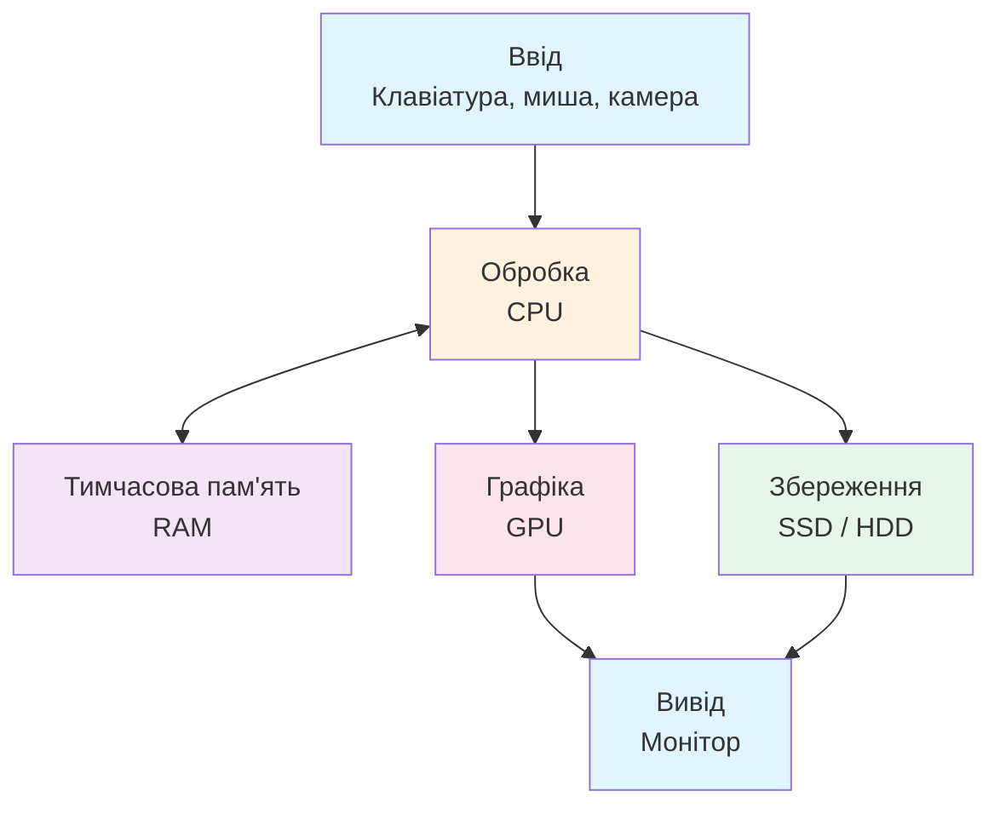
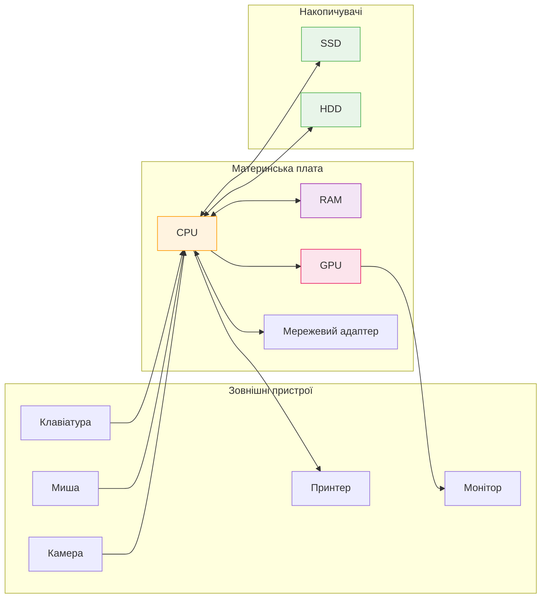

# Лекція 11. Велика карта комп’ютера

> **Рівень 3: Дослідник заліза**
>
> Марко, сьогодні ми не просто вивчимо новий термін — ми відкриємо ще один шар того, як насправді працює комп’ютер.

## Що ми сьогодні розкриємо

- побачити комп’ютер як систему взаємодіючих частин
- знати ролі CPU, RAM, накопичувача, GPU та периферії
- розрізняти введення, обробку, збереження і виведення

## Комп’ютер — це команда, а не одна чарівна коробка

Коли ти запускаєш гру, працює не «комп’ютер взагалі». Клавіатура надсилає введення, процесор виконує інструкції, RAM тримає активні дані, GPU малює кадри, SSD зберігає файли, а монітор показує результат.

Корисна карта:



## Головні ролі

- **CPU** — виконує інструкції й керує обчисленнями.
- **RAM** — швидке робоче місце для того, що потрібно зараз.
- **SSD/HDD** — довготривале збереження файлів.
- **GPU** — особливо добре виконує багато обчислень, потрібних для графіки та не тільки.
- **Motherboard** — плата, яка фізично з’єднує багато компонентів.
- **Мережевий адаптер** — допомагає обмінюватися даними мережею.
- **Периферія** — клавіатура, миша, камера, принтер тощо.



## Потік даних на прикладі Python

Ти натискаєш клавішу `A`. Пристрій введення повідомляє про подію ОС. Програма отримує символ. CPU виконує код. Дані опиняються в RAM. Якщо ти збережеш файл — байти записуються на SSD. Якщо зробиш `print()` — результат зрештою потрапляє на екран.

Ми ще детально розберемо кожен шар окремо.

## Приклади

### Приклад 1

Відкрити фото: SSD читає файл → дані потрапляють у RAM → CPU/GPU обробляють формат → екран показує пікселі.

### Приклад 2

Надрукувати текст: клавіатура дає введення → програма обробляє → RAM тримає поточний документ → SSD зберігає файл.

### Приклад 3

Відеодзвінок одночасно використовує камеру, мікрофон, CPU/GPU, RAM, мережу, динаміки й екран.

## Лабораторія: інвентаризація без розбирання корпуса

У терміналі Linux виконай лише команди спостереження:

```bash
uname -a
lscpu | head
free -h
lsblk
```

Не треба розуміти кожен рядок. Зараз наша мета — знайти знайомі категорії: процесор, пам’ять, диски, ОС.

## Місія для Марка

Виконай місію по черзі. Якщо щось не виходить — спочатку перечитай приклад вище й спробуй знайти, на якому кроці результат відрізняється.

1. намалюй схему свого комп’ютера з блоками CPU, RAM, SSD, GPU, ввід, вивід
2. виконай чотири команди лабораторії й випиши по одному факту з кожної
3. обери дію «запустити Minecraft» і назви щонайменше чотири компоненти, які беруть участь
4. класифікуй клавіатуру, монітор, SSD та CPU за ролями: ввід/вивід/зберігання/обробка
5. поясни, чому RAM і SSD не можна вважати одним і тим самим

## Перевір себе

- Яка головна роль CPU?
- Для чого потрібна RAM?
- Що зберігає дані після вимкнення живлення?
- Чи є монітор пристроєм введення?
- Які компоненти можуть працювати разом під час відеодзвінка?

## Терміни однією фразою

- **CPU (процесор)** — виконує інструкції й керує обчисленнями.
- **RAM (оперативна пам’ять)** — швидке робоче місце для даних, з якими працюємо зараз; зникає після вимкнення.
- **SSD/HDD (накопичувач)** — довготривале збереження файлів навіть без живлення.
- **GPU (відеокарта/графічний процесор)** — особливо добре вміє робити багато обчислень для графіки.
- **Motherboard (системна плата)** — велика плата, яка з’єднує та «знайомить» компоненти.
- **Периферія** — пристрої навколо комп’ютера: клавіатура, миша, монітор, принтер.
- **Ввід / обробка / збереження / вивід** — чотири етапи руху даних у комп’ютері.

## Що потрібно винести з лекції

- комп’ютер — система компонентів із різними ролями
- дані постійно рухаються між введенням, обробкою, пам’яттю, збереженням і виведенням
- Linux дозволяє досліджувати компоненти командами без розбирання комп’ютера

---

**Хакерський принцип:** не запам’ятовуй магічні слова. Намагайся пояснити своїми словами, що відбулося і чому.
