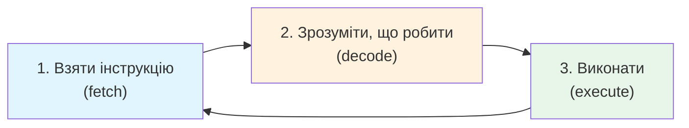

# Лекція 12. CPU — виконавець команд

> **Рівень 3: Дослідник заліза**
>
> Марко, сьогодні ми не просто вивчимо новий термін — ми відкриємо ще один шар того, як насправді працює комп’ютер.

## Що ми сьогодні розкриємо

- розуміти базову роль процесора
- знати, що таке ядра та частота на простому рівні
- знайти модель CPU своєї Linux-системи

## Зв’язок з попередніми лекціями

У цій лекції ми використаємо поняття CPU з лекції 11, щоб заглибитись у те, як процесор виконує інструкції.

## CPU читає й виконує інструкції

Процесор можна уявити як неймовірно швидкого виконавця дуже маленьких команд: взяти значення, додати, порівняти, перейти до іншої інструкції, перемістити дані.

Python-код не виконується процесором буквально як текст `print(...)`. Між твоїм кодом і апаратними інструкціями є інтерпретатор Python, операційна система та інші шари. Але внизу ланцюжка роботу все одно виконує CPU.

Робота CPU — це постійний цикл із трьох кроків:



Його повторюють мільярди разів на секунду.

## Ядра — кілька виконавців усередині одного процесора

Сучасний CPU має кілька **ядер**. Це дозволяє системі виконувати більше роботи паралельно. Але 8 ядер не означає, що будь-яка програма автоматично стане рівно у 8 разів швидшою: не кожне завдання можна ідеально поділити.

## GHz — частота, але не «бал сили»

Гігагерц описує частоту тактового сигналу. Це важлива характеристика, але не універсальний рейтинг швидкості. Два різні процесори з однаковими GHz можуть виконувати різну кількість корисної роботи за той самий час через архітектуру, кеш, кількість ядер та інші особливості.

## Приклади

### Приклад 1

Якщо програма рахує суму мільйона чисел, CPU багато разів виконує операції завантаження, додавання та керування циклом.

### Приклад 2

Під час гри одне ядро може працювати над частиною логіки, інші — над фоновими задачами ОС; реальний розподіл складний і керується планувальником.

### Приклад 3

Назва `x86_64` або `aarch64` описує сімейство архітектури/набору інструкцій, а не бренд комп’ютера.

## Linux-лабораторія: паспорт процесора

```bash
lscpu
```

Знайди рядки на кшталт:

```text
Architecture:
CPU(s):
Model name:
```

Для короткого перегляду можна використати:

```bash
lscpu | grep -E 'Model name|CPU\(s\)|Architecture'
```

## Місія для Марка

Виконай місію по черзі. Якщо щось не виходить — спочатку перечитай приклад вище й спробуй знайти, на якому кроці результат відрізняється.

1. виконай `lscpu` і запиши модель процесора
2. знайди архітектуру
3. знайди число логічних CPU, яке показує система
4. створи `cpu_note.txt` із трьома знайденими фактами будь-яким знайомим способом
5. поясни, чому не можна порівнювати процесори лише за GHz

## Перевір себе

- Що виконує CPU?
- Що таке ядро?
- Чи гарантують удвічі більше ядер удвічі більшу швидкість будь-якої програми?
- Що приблизно описують GHz?
- Яка Linux-команда показує інформацію про CPU?

## Терміни однією фразою

- **Інструкція** — одна крихітна команда для процесора (взяти, додати, порівняти).
- **Ядро (core)** — один «виконавець» усередині процесора; кілька ядер працюють паралельно.
- **Частота (GHz)** — скільки тактів за секунду; важлива, але не єдиний показник швидкості.
- **Архітектура (набір інструкцій)** — «мова», якою розмовляє процесор (наприклад `x86_64`).
- **Інтерпретатор** — програма, яка читає і виконує твій код крок за кроком (Python).
- **Планувальник** — частина ОС, що вирішує, якому процесу коли дати CPU.

## Чек-лист перед наступною лекцією

- [ ] Чи можеш ти пояснити, що таке ядра процесора та як вони працюють?
- [ ] Чи знаєш ти, що таке GHz і як він пов'язаний з швидкістю процесора?
- [ ] Чи розумієш ти різницю між інтерпретатором та компілятором?

## Що потрібно винести з лекції

- CPU виконує інструкції над даними
- ядра дозволяють системі виконувати більше роботи паралельно
- характеристики процесора треба читати разом, а не зводити до одного числа

---

**Хакерський принцип:** не запам’ятовуй магічні слова. Намагайся пояснити своїми словами, що відбулося і чому.
