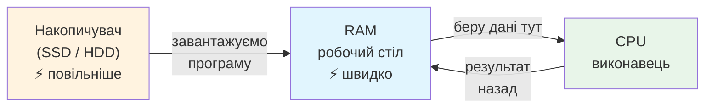

# Лекція 13. RAM — робочий стіл комп’ютера

> **Рівень 3: Дослідник заліза**
>
> Марко, сьогодні ми не просто вивчимо новий термін — ми відкриємо ще один шар того, як насправді працює комп’ютер.

## Що ми сьогодні розкриємо

- відрізняти RAM від накопичувача
- зрозуміти, чому активним програмам потрібна оперативна пам’ять
- дослідити RAM командою `free -h`

## Зв’язок з попередніми лекціями

У цій лекції ми використаємо поняття RAM із лекції 11, щоб зрозуміти, чому активним програмам потрібна оперативна пам’ять.

## Робочий стіл проти шафи

Уяви робочий стіл. На ньому лежать зошит, олівець і деталі LEGO, з якими ти працюєш **зараз**. Це RAM. Шафа, де лежать коробки, які можуть знадобитися завтра, — SSD.

Коли запускаєш програму, потрібні їй код і дані завантажуються з накопичувача в оперативну пам’ять. CPU працює з ними звідти набагато швидше.



## RAM є тимчасовою

Звичайна оперативна пам’ять потребує живлення. Після вимкнення комп’ютера її вміст не зберігається як файли. Тому незбережений документ може зникнути після аварійного вимкнення.

SSD, навпаки, зберігає дані без постійного живлення.

## Вільна RAM — не єдина корисна RAM

Linux може використовувати частину пам’яті як кеш, щоб пришвидшувати роботу. Тому число `free` не варто читати як «усе інше пропало». Команда `free -h` має також колонку `available`, яка приблизно показує, скільки пам’яті можна надати новим програмам без серйозних проблем.

## Приклади

### Приклад 1

Відкрити браузер із багатьма вкладками — кожна вкладка та сам браузер використовують частину RAM.

### Приклад 2

Зберегти документ означає записати його на довготривалий накопичувач; просто бачити текст у відкритій програмі ще не означає, що останні зміни вже на SSD.

### Приклад 3

Якщо робочий стіл переповнений, працювати незручно. Так само при нестачі RAM система може сповільнюватися й використовувати інші механізми, наприклад swap.

## Linux-лабораторія: скільки в нас робочого столу?

```bash
free -h
```

Подивися на рядок `Mem:` і колонки `total`, `used`, `free`, `available`.

Потім відкрий кілька програм або вкладок браузера й повтори команду. Не очікуй ідеально однакових чисел — система постійно працює.

## Місія для Марка

Виконай місію по черзі. Якщо щось не виходить — спочатку перечитай приклад вище й спробуй знайти, на якому кроці результат відрізняється.

1. запиши загальний обсяг RAM із `free -h`
2. запиши `available` до й після відкриття кількох програм
3. поясни різницю між RAM і SSD через аналогію стіл/шафа
4. придумай, що може статися з незбереженим текстом після раптового вимкнення
5. назви дві причини, чому значення пам’яті між двома запусками команди може змінитися

## Перевір себе

- Чи зберігає RAM дані після вимкнення?
- Чому програмам потрібна RAM?
- Що показує `free -h`?
- Чому `free` і `available` можуть сильно відрізнятися?
- Що в аналогії відповідає SSD?

## Терміни однією фразою

- **Оперативна пам’ять (RAM)** — «робочий стіл»: тут лежить те, з чим працюємо зараз; швидко, але тимчасово.
- **Накопичувач (SSD/HDD)** — «шафа»: довготривале зберігання файлів.
- **Тимчасова пам’ять** — зникає, коли зникає живлення.
- **Кеш** — запас актуальних даних, щоб швидше відповідати на повторні запити.
- **`available`** — колонка `free -h`, приблизно скільки пам’яті реально можна дати новим програмам.
- **Swap** — спеціальне місце на диску, куди система може виносити щось із RAM, коли бракує місця.

## Чек-лист перед наступною лекцією

- [ ] Чи можеш ти пояснити різницю між RAM та SSD?
- [ ] Чи знаєш ти, як перевірити доступну пам'ять у Linux?
- [ ] Чи розумієш ти, що таке swap і навіщо він потрібен?

## Що потрібно винести з лекції

- RAM — швидка тимчасова пам’ять для активної роботи
- SSD/HDD — довготривале збереження, RAM — робоча область
- Linux сам керує пам’яттю, зокрема може використовувати її для кешу

---

**Хакерський принцип:** не запам’ятовуй магічні слова. Намагайся пояснити своїми словами, що відбулося і чому.
