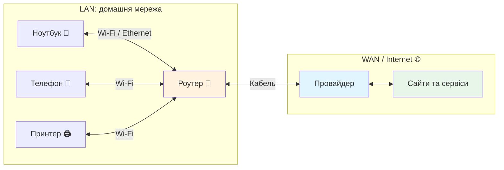
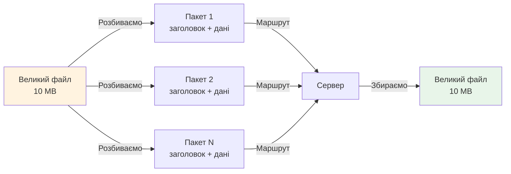

# Лекція 30. Що таке комп’ютерна мережа

> **Рівень 6: Мережевий слідопит**
>
> Марко, сьогодні ми не просто вивчимо новий термін — ми відкриємо ще один шар того, як насправді працює комп’ютер.

## Що ми сьогодні розкриємо

- зрозуміти мережу як обмін даними між пристроями
- розрізняти LAN, WAN та Internet на базовому рівні
- побачити пакет як маленьку порцію даних

## Мережа починається з двох пристроїв, які можуть обмінюватися даними

Марко, до цього ми досліджували один комп’ютер. Тепер уяви два ноутбуки, які хочуть передати один одному файл. Їм потрібен канал зв’язку і спільні правила.

Канал може бути кабельним Ethernet або бездротовим Wi‑Fi. Але сам кабель ще не створює змісту: пристроям потрібні адреси й протоколи, які ми поступово вивчимо.

## LAN, WAN та Internet



**LAN** — локальна мережа, наприклад пристрої вдома або в школі. **WAN** — мережа на більшій території, яка може з’єднувати багато локальних мереж. **Internet** — глобальна «мережа мереж», побудована з величезної кількості взаємопов’язаних мереж.

Інтернет — не Wi‑Fi. Wi‑Fi лише один зі способів з’єднати твій пристрій із локальною мережею.

## Дані подорожують порціями

Мережеві дані часто передаються **пакетами**. Уяви велику LEGO-модель, яку розібрали на коробки для перевезення. Кожна коробка має службову інформацію, щоб її можна було доставити й правильно зібрати.



Реальні мережеві пакети мають кілька шарів заголовків і правил. Поки що нам достатньо ідеї: велике повідомлення не обов’язково летить одним гігантським шматком.

## Приклади

### Приклад 1

Домашній ноутбук і принтер можуть спілкуватися всередині LAN, навіть якщо Інтернет тимчасово не працює.

### Приклад 2

Телефон може бути підключений до домашньої мережі через Wi‑Fi, а роутер — до провайдера кабелем. Це різні ділянки одного маршруту.

### Приклад 3

Коли браузер завантажує сторінку, різні порції даних проходять через багато пристроїв між клієнтом і сервером.

## Лабораторія: знайдемо мережеві інтерфейси

```bash
ip link
```

Ти можеш побачити інтерфейси на кшталт `lo`, `eth...`, `enp...`, `wlan...` або `wlp...`. Назви залежать від системи.

`lo` — loopback, внутрішній мережевий інтерфейс самого комп’ютера. Скоро він стане дуже корисним.

## Місія для Марка

Виконай місію по черзі. Якщо щось не виходить — спочатку перечитай приклад вище й спробуй знайти, на якому кроці результат відрізняється.

1. виконай `ip link` і порахуй мережеві інтерфейси
2. спробуй визначити, який інтерфейс схожий на Wi‑Fi або Ethernet
3. намалюй домашню схему: ноутбук → роутер → провайдер → Internet
4. поясни, чому Wi‑Fi і Internet — не синоніми
5. назви приклад обміну даними, який може працювати всередині LAN без доступу до глобального Інтернету

## Перевір себе

- Що таке LAN?
- Що таке Internet?
- Чи є Wi‑Fi самим Інтернетом?
- Навіщо великі дані ділити на пакети?
- Що показує `ip link`?

## Терміни однією фразою

- **LAN** — локальна мережа: пристрої вдома або в школі.
- **WAN** — мережа на більшій території, що з’єднує багато LAN.
- **Internet** — глобальна «мережа мереж» з величезної кількості взаємопов’язаних мереж.
- **Пакет** — маленька порція даних зі службовою інформацією для доставки.
- **Інтерфейс** — мережевий «порт» на комп’ютері (провід, Wi‑Fi).
- **Маршрут** — шлях, яким пакети рухаються від відправника до отримувача.

## Що потрібно винести з лекції

- мережа дозволяє пристроям обмінюватися даними
- локальна мережа і глобальний Internet — різні масштаби
- пакети є порціями даних, що рухаються мережею

---

**Хакерський принцип:** не запам’ятовуй магічні слова. Намагайся пояснити своїми словами, що відбулося і чому.
