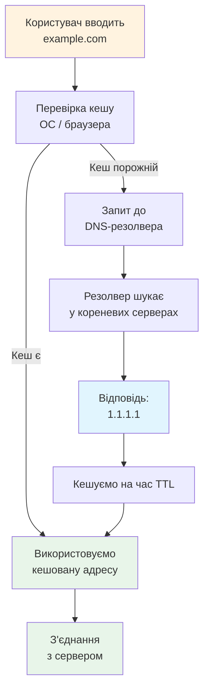

# Лекція 34. DNS — телефонна книга Інтернету

> **Рівень 6: Мережевий слідопит**
>
> Марко, сьогодні ми не просто вивчимо новий термін — ми відкриємо ще один шар того, як насправді працює комп’ютер.

## Що ми сьогодні розкриємо

- зрозуміти різницю між доменним ім’ям та IP-адресою
- побачити роль DNS resolver
- виконати простий DNS-запит

## Зв’язок з попередніми лекціями

У цій лекції ми використаємо знання про IP-адреси з лекції 31, щоб зрозуміти, як DNS перетворює зручні імена сайтів на адреси.

## Людям зручні імена, мережі працюють з адресами

Запам’ятовувати `example.com` легше, ніж набір IP-адрес. **DNS** — Domain Name System — допомагає знаходити записи, пов’язані з доменними іменами, зокрема IP-адреси.

Аналогія з телефонною книгою корисна, але неповна: DNS зберігає різні типи записів, має ієрархію та кешування.

## DNS-запит — окрема частина відкриття сайту

Коли ти вводиш домен у браузер, системі спочатку може знадобитися перетворити ім’я на адресу. Лише після цього встановлюється мережеве з’єднання з потрібним сервером.

Отже, «Інтернет працює» і «DNS працює» — не одна й та сама перевірка.

## Кеш прискорює повторні відповіді

DNS-відповіді можуть кешуватися на деякий час. Це схоже на те, як ти записав номер друга в контакти й не питаєш телефонну книгу щоразу. Але записи можуть змінюватися, тому кеш має час життя.



## Приклади

### Приклад 1

`example.com` — доменне ім’я; адреса, яку поверне DNS, може змінюватися з часом або залежати від мережі.

### Приклад 2

Один домен може мати кілька IP-адрес для розподілу навантаження чи інших причин.

### Приклад 3

DNS може містити не тільки A/AAAA-адреси, а й записи пошти та інші типи. Нам поки достатньо знати, що це система імен, а не один файл.

## Linux-лабораторія: запитай DNS

Якщо встановлено `getent`, зазвичай достатньо:

```bash
getent ahosts example.com
```

Якщо є `nslookup`:

```bash
nslookup example.com
```

А якщо встановлено `dig`:

```bash
dig example.com
```

Не потрібно встановлювати додатковий пакет лише заради цієї лекції: використай доступний інструмент.

## Місія для Марка

Виконай місію по черзі. Якщо щось не виходить — спочатку перечитай приклад вище й спробуй знайти, на якому кроці результат відрізняється.

1. зроби DNS-запит для `example.com`
2. повтори його для ще одного відомого домену
3. запиши домен і одну отриману адресу
4. поясни порядок «ім’я → DNS → IP → з’єднання»
5. придумай ситуацію: IP-зв’язок працює, але DNS зламався — що тоді може бачити користувач?

## Перевір себе

- Що розшифровується як DNS?
- Чим домен відрізняється від IP-адреси?
- Чи може домен мати кілька адрес?
- Навіщо DNS кеш?
- Чому проблема DNS не обов’язково означає повну відсутність мережі?

## Терміни однією фразою

- **DNS (Domain Name System)** — «телефонна книга» Інтернету: пов’язує доменні імена з мережевими адресами.
- **Доменне ім’я** — зручне людям ім’я сайту (наприклад `example.com`).
- **IP-адреса** — мережева адреса, потрібна для доставки пакетів.
- **DNS resolver (резолвер)** — служба, яка відповідає на запити «яка адреса в цього домену?».
- **Запис (record)** — окремий елемент даних у DNS (наприклад A/AAAA-адреса).
- **TTL (час життя кешу)** — скільки часу можна зберігати відповідь, перш ніж спитати знову.
- **`getent` / `nslookup` / `dig`** — команди DNS-запитів.

## Чек-лист перед наступною лекцією

- [ ] Чи можеш ти пояснити, як DNS перетворює доменні імена на IP-адреси?
- [ ] Чи знаєш ти, що таке DNS-записи та TTL?
- [ ] Чи розумієш ти, як працює кешування DNS?

## Що потрібно винести з лекції

- DNS пов’язує доменні імена з мережевими даними, зокрема адресами
- DNS-запит — окремий крок перед багатьма мережевими з’єднаннями
- імена зручні людям, адреси потрібні мережевому маршруту

---

**Хакерський принцип:** не запам’ятовуй магічні слова. Намагайся пояснити своїми словами, що відбулося і чому.
