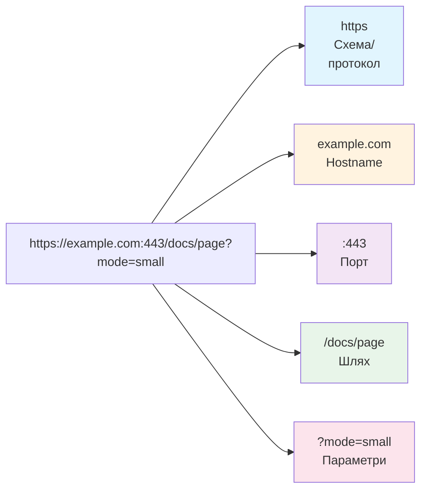
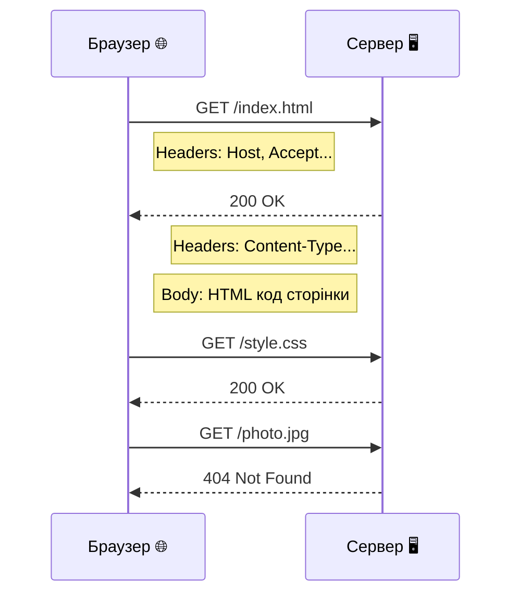

# Лекція 35. URL, HTTP і веб

> **Рівень 6: Мережевий слідопит**
>
> Марко, сьогодні ми не просто вивчимо новий термін — ми відкриємо ще один шар того, як насправді працює комп’ютер.

## Що ми сьогодні розкриємо

- розібрати URL на частини
- зрозуміти модель HTTP request/response
- побачити сирий HTTP-вміст через `curl`

## URL — точна адреса ресурсу

Розглянь:

```text
https://example.com:443/docs/page?mode=small
```

Спрощено:
- `https` — схема/протокол доступу;
- `example.com` — hostname;
- `443` — порт, часто не пишеться, бо для HTTPS він типовий;
- `/docs/page` — path;
- `?mode=small` — query string.

Не кожен URL містить усі частини явно.



## HTTP — правила запитів і відповідей

Браузер як клієнт надсилає HTTP-запит: наприклад «дай ресурс `/`». Сервер повертає відповідь: статус, заголовки та, можливо, тіло сторінки.

Статуси мають коди: `200` часто означає успіх, `404` — ресурс не знайдено. Є багато інших.



## HTTPS = HTTP через захищене з’єднання

HTTPS додає TLS-захист каналу: шифрування, перевірку справжності сервера за сертифікатом та цілісність переданих даних. Це значно більше, ніж «буква S».

HTTPS не гарантує, що сам сайт добрий або чесний; воно захищає транспортне з’єднання з тим сайтом, чию адресу ти відкрив.

## Приклади

### Приклад 1

`curl https://example.com` отримує тіло відповіді без графічного браузера.

### Приклад 2

`curl -I https://example.com` просить показати лише заголовки відповіді в типовому сценарії HEAD.

### Приклад 3

URL `http://localhost:8000/index.html` вказує на локальний хост, порт 8000 і шлях `/index.html`. Саме такий URL ми використаємо для власного сервера.

## Linux-лабораторія: браузер без вікна

```bash
curl https://example.com
curl -I https://example.com
```

За бажанням і за наявності мережі:

```bash
curl wttr.in/Kyiv
```

Останній сервіс зовнішній і може змінюватися або бути недоступним; головний навчальний приклад — `example.com`, спеціально створений для документаційних прикладів.

## Місія для Марка

Виконай місію по черзі. Якщо щось не виходить — спочатку перечитай приклад вище й спробуй знайти, на якому кроці результат відрізняється.

1. розбери URL `https://example.com:443/docs/page?mode=small` на частини
2. виконай `curl` і `curl -I` для `example.com`
3. знайди HTTP status у заголовках
4. поясни модель клієнт → request → server → response
5. поясни, чого HTTPS **не** гарантує про зміст сайту

## Перевір себе

- Що таке URL?
- Що таке HTTP request?
- Що таке HTTP response?
- Що часто означає статус 404?
- Яку додаткову ідею дає HTTPS?

## Що потрібно винести з лекції

- URL описує місце й спосіб доступу до ресурсу
- HTTP організований навколо запитів і відповідей
- curl дозволяє досліджувати веб без графічного браузера

---

**Хакерський принцип:** не запам’ятовуй магічні слова. Намагайся пояснити своїми словами, що відбулося і чому.
