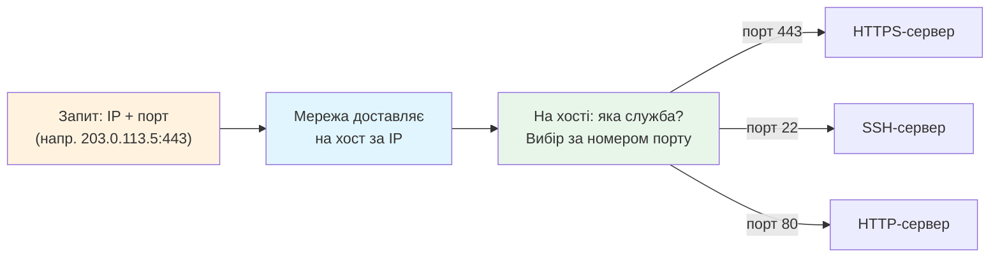

# Лекція 38. Мережеві порти: номер дверей

> **Рівень 6: Мережевий слідопит**
>
> Марко, сьогодні ми не просто вивчимо новий термін — ми відкриємо ще один шар того, як насправді працює комп’ютер.

## Що ми сьогодні розкриємо

- зрозуміти мережевий порт як логічний номер служби
- побачити зв’язок IP + port
- переглянути слухаючі сокети через `ss`

## Зв’язок з попередніми лекціями

У цій лекції ми використаємо розуміння пари client/server з лекції 37, щоб розібратися, як порти розрізняють мережеві служби.

## Однієї IP-адреси замало

На одному комп’ютері одночасно можуть працювати вебсервер, SSH та інші служби. IP-адреса допомагає знайти хост, а **порт** — потрібну мережеву службу/кінцеву точку транспортного з’єднання.

Дитяча аналогія:

```text
IP-адреса = адреса будинку
порт      = номер дверей/офісу
```

Але пам’ятай: це логічний номер, не фізичний роз’єм.



## Порт — число від 0 до 65535

У TCP та UDP порт кодується 16 бітами, тому можливі значення 0–65535. Деякі порти мають відомі стандартні призначення: 80 для HTTP, 443 для HTTPS, 22 для SSH. Але служба технічно може слухати й інший порт, якщо це налаштовано.

## Слухати порт — чекати вхідних з’єднань/датаграм

Коли ми запускали `http.server 8000`, Python створив мережевий сокет і почав слухати порт 8000. Інструмент `ss` дозволяє побачити такі сокети.

## Приклади

### Приклад 1

`http://127.0.0.1:8000` явно задає хост `127.0.0.1` і порт `8000`.

### Приклад 2

Якщо сервер слухає `8000`, а клієнт звертається на `8001`, це інша «двері» й відповіді від нашого сервера там не буде.

### Приклад 3

Порт 443 типовий для HTTPS, тому браузер зазвичай не показує `:443` у звичайному HTTPS URL.

## Linux-лабораторія: знайди свої двері

У першому терміналі знову:

```bash
cd ~/marko-lab/web
python3 -m http.server 8000 --bind 127.0.0.1
```

У другому:

```bash
ss -ltn
```

Шукай локальну адресу з `:8000`. Після `Ctrl+C` повтори `ss -ltn` і перевір, що слухаючий порт зник.

## Місія для Марка

Виконай місію по черзі. Якщо щось не виходить — спочатку перечитай приклад вище й спробуй знайти, на якому кроці результат відрізняється.

1. запусти локальний сервер на 8000
2. знайди його через `ss -ltn`
3. спробуй браузером `localhost:8000` і потім `localhost:8001` та порівняй
4. зупини сервер і переконайся, що порт 8000 більше не слухається
5. поясни різницю між USB-портом із лекції 15 і TCP-портом 8000

## Перевір себе

- Навіщо потрібен мережевий порт?
- Який діапазон номерів має TCP/UDP port?
- Який порт типовий для HTTPS?
- Що означає «сервер слухає порт»?
- Яка команда показує слухаючі TCP-сокети?

## Терміни однією фразою

- **Порт (port)** — логічний номер «дверей», через які сервер приймає запити.
- **IP + port** — пара, яка адресує конкретну мережеву службу на хості.
- **Типові порти** — 80 (HTTP), 443 (HTTPS), 22 (SSH).
- **Слухати порт** — чекати вхідних з’єднань або даних на певному порту.
- **Сокет** — кінцева точка мережевого з’єднання; те, звідки/ куди «йдуть» дані.
- **`ss -ltn`** — команда для перегляду слухаючих TCP-сокетів.

## Чек-лист перед наступною лекцією

- [ ] Чи можеш ти пояснити, що таке порти та сокети?
- [ ] Чи вмієш ти переглядати відкриті порти за допомогою `ss -ltn`?
- [ ] Чи розумієш ти, як мережеві програми використовують порти для з'єднань?

## Що потрібно винести з лекції

- IP і port разом допомагають адресувати мережеву службу
- мережевий порт — логічний номер, не фізичний роз’єм
- `ss` дозволяє побачити, які служби слухають мережу

---

**Хакерський принцип:** не запам’ятовуй магічні слова. Намагайся пояснити своїми словами, що відбулося і чому.
