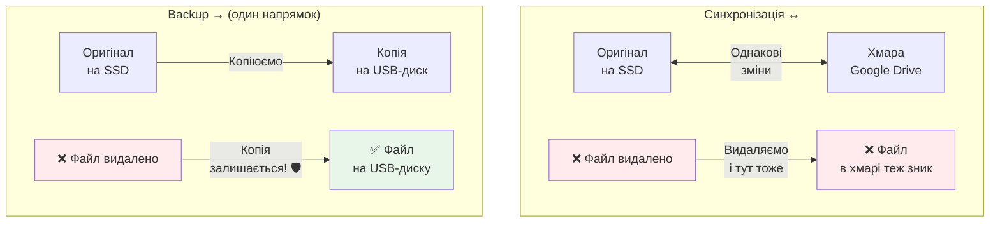
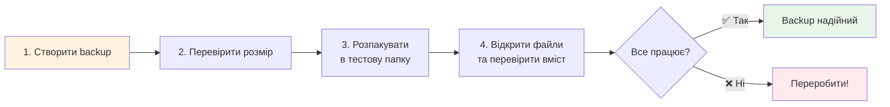

# Лекція 41. Оновлення і резервні копії

> **Рівень 7: Вартовий цифрової фортеці**
>
> Марко, сьогодні ми не просто вивчимо новий термін — ми відкриємо ще один шар того, як насправді працює комп’ютер.

## Що ми сьогодні розкриємо

- зрозуміти, навіщо оновлювати програмне забезпечення
- відрізняти копію, backup і синхронізацію
- зробити просту перевірювану резервну копію навчальної папки

## Зв’язок з попередніми лекціями

У цій лекції ми використаємо знання про файли з лекції 17, щоб зрозуміти, як оновлювати програмне забезпечення та робити резервні копії.

## Оновлення виправляють не лише «нові кнопки»

Програми містять помилки. Частина помилок може створювати **вразливості** — способи обійти очікуваний захист. Оновлення можуть виправляти баги, закривати вразливості та покращувати сумісність.

Саме тому «не чіпай, якщо працює» не завжди хороше правило для безпеки.

## Backup — запасний шлях до даних

Резервна копія потрібна не тоді, коли файл уже зник, а **до** проблеми. Хороша копія має бути окремою настільки, щоб одна помилка не знищила і оригінал, і копію.

Якщо ти випадково видалив файл, а синхронізація миттєво видалила його в хмарі теж, синхронізація не виконала роль історичної резервної копії.



## Backup треба вміти відновити

Фраза «десь є копія» не гарантує захист. Потрібно інколи перевіряти, що архів відкривається, файли читаються, а потрібні дані справді потрапили до копії.



## Приклади

### Приклад 1

Git допомагає з історією коду, але не замінює всі види резервного копіювання диска або фото.

### Приклад 2

Копія на тому самому SSD захищає від випадкового редагування оригіналу, але не від поломки самого SSD.

### Приклад 3

Оновлення системи через пакетний менеджер і backup — різні задачі: одне зменшує частину ризиків ПЗ, інше допомагає відновити дані.

## Linux-лабораторія: backup, який ми перевіримо

Створимо архів лише навчальної папки:

```bash
cd ~
tar -czf marko-lab-backup.tar.gz marko-lab
ls -lh marko-lab-backup.tar.gz
mkdir -p ~/marko-lab-restore-test
tar -xzf marko-lab-backup.tar.gz -C ~/marko-lab-restore-test
ls ~/marko-lab-restore-test/marko-lab
```

Це локальна навчальна копія, а не повна стратегія backup. Ми тренуємо головну навичку: **створив → перевірив відновлення**.

## Місія для Марка

Виконай місію по черзі. Якщо щось не виходить — спочатку перечитай приклад вище й спробуй знайти, на якому кроці результат відрізняється.

1. створи архів `marko-lab-backup.tar.gz`
2. перевір його розмір
3. розпакуй у тестову папку
4. відкрий хоча б один відновлений текстовий файл
5. поясни, від яких проблем ця локальна копія захищає, а від яких — ні

## Перевір себе

- Навіщо потрібні оновлення?
- Що таке vulnerability?
- Чому sync не завжди дорівнює backup?
- Навіщо тестувати відновлення?
- Чи захищає копія на тому самому диску від поломки самого диска?

## Терміни однією фразою

- **Бекап (backup)** — копія для відновлення після втрати даних.
- **Синхронізація** — зведення двох копій до стану «однакові».
- **Бітове копіювання** — копіювання «як є», включно з прихованими файлами.
- **Різниця (diff)** — те, що відрізняє дві копії.
- **`rsync`** — утиліта для копіювання з мережевим або локальним прискоренням.
- **Точність відновлення** — здатність отримати конкретний файл або час з бекапу.

## Чек-лист перед наступною лекцією

- [ ] Чи можеш ти пояснити різницю між резервним копіюванням та синхронізацією?
- [ ] Чи вмієш ти використовувати `rsync` для копіювання файлів?
- [ ] Чи розумієш ти, навіщо потрібні резервні копії та як їх створювати?

## Що потрібно винести з лекції

- оновлення можуть закривати вразливості та виправляти помилки
- backup треба робити до аварії й перевіряти відновлення
- різні ризики потребують різних рівнів резервування

---

**Хакерський принцип:** не запам’ятовуй магічні слова. Намагайся пояснити своїми словами, що відбулося і чому.
