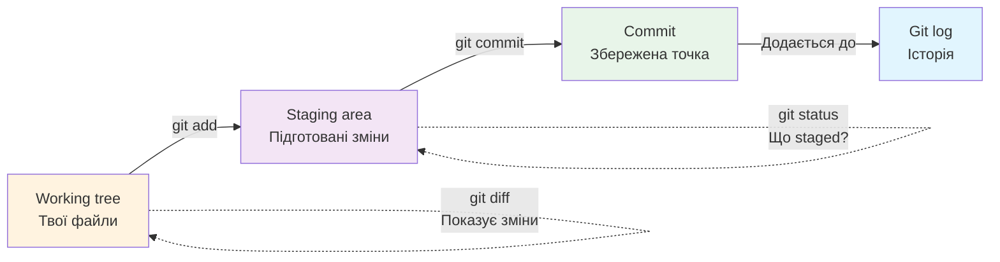

# Лекція 44. Як Git бачить зміни: working tree, staging area, commit

> **Рівень 8: Хранитель історії коду**
>
> Марко, сьогодні ми не просто вивчимо новий термін — ми відкриємо ще один шар того, як насправді працює комп’ютер.

## Що ми сьогодні розкриємо

- зрозуміти три основні стани змін
- користуватися `git add`, `git status`, `git commit`, `git log`
- робити маленькі логічні commits

## Working tree — твій робочий стіл

Ти редагуєш файли у звичайній папці. Це **working tree**. Git помічає, що вони нові або змінені, але ще не означає, що зміни потраплять до наступного commit.

## Staging area — коробка «це беру в наступне збереження»

`git add file` додає **поточну версію змін** до staging area. Це як покласти вибрані LEGO-деталі у коробку перед фотографуванням конструкції.

Якщо після `git add` ще раз змінити файл, Git може одночасно мати staged-версію та нові unstaged-зміни. Тому `git status` — наш найкращий друг.

## Commit записує staged-зміни в історію

`git commit -m "message"` створює commit із тим, що було підготовлено. Хороше повідомлення коротко пояснює логічну зміну: `Add greeting` краще за `stuff`.



## Приклади

### Приклад 1

`git add app.py` не відправляє файл у GitHub і не створює commit. Воно готує зміни локально.

### Приклад 2

`git log --oneline` показує коротку історію commits.

### Приклад 3

Звичка: **редагуй → git status → git diff → git add → git status → git commit**.

## Git-лабораторія: перший commit

У репозиторії з лекції 43. Якщо Git ще не має імені автора, разом із дорослим налаштуйте локально для цього репозиторію, наприклад:

```bash
git config user.name "Marko"
git config user.email "privacy-friendly-address@example.invalid"
```

Для реального GitHub пізніше використовуйте privacy-friendly адресу, яку надає GitHub, або іншу адресу, яку дорослий свідомо обрав.

Далі:

```bash
git status
git add app.py
git status
git commit -m "Add first Python program"
git log --oneline
```

## Місія для Марка

Виконай місію по черзі. Якщо щось не виходить — спочатку перечитай приклад вище й спробуй знайти, на якому кроці результат відрізняється.

1. зроби перший commit `app.py`
2. зміни текст на `Version 2`
3. виконай `git diff` до `git add`
4. підготуй зміну через `git add` і ще раз перевір `git status`
5. створи другий commit і переглянь два рядки в `git log --oneline`

## Перевір себе

- Що таке working tree?
- Що робить `git add`?
- Що потрапляє в commit?
- Що показує `git status`?
- Навіщо маленькі зрозумілі commit messages?

## Терміни однією фразою

- **Working tree** — робоча папка з файлами, де ти редагуєш.
- **Staging area** — підготовлений набір змін перед наступним commit.
- **`git add`** — додає поточну версію змін до staging area.
- **`git commit`** — зберігає staged-зміни в історію.
- **`git log --oneline`** — показує короткий список commits.
- **`git status`** — показує стан working tree та staging area.
- **`git diff`** — показує різницю між версіями.

## Що потрібно винести з лекції

- Git дозволяє вибирати, які зміни ввійдуть у наступну контрольну точку
- staging area стоїть між робочими файлами й commit
- `git status` і `git diff` допомагають не діяти наосліп

---

**Хакерський принцип:** не запам’ятовуй магічні слова. Намагайся пояснити своїми словами, що відбулося і чому.
