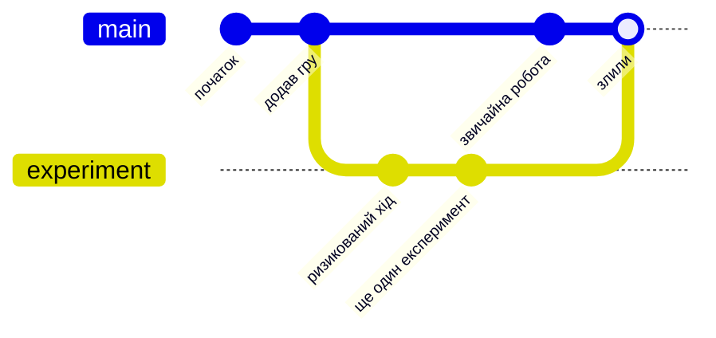

# Лекція 46. Гілки Git: безпечні паралельні експерименти

> **Рівень 8: Хранитель історії коду**
>
> Марко, сьогодні ми не просто вивчимо новий термін — ми відкриємо ще один шар того, як насправді працює комп’ютер.

## Що ми сьогодні розкриємо

- зрозуміти branch як рухомий покажчик на історію
- створити й переключити гілку
- зробити експеримент, не змінюючи main напряму

## Зв’язок з попередніми лекціями

У цій лекції ми використаємо знання про Git із лекцій 43—45, щоб навчитися створювати та перемикати гілки.

## Гілка — окрема лінія розвитку

Уяви гру, де ти зробив save point і хочеш спробувати ризикований маршрут, не псуючи основне проходження. У Git для паралельної роботи є **branches**.

Технічно branch — легкий рухомий покажчик на commit, але для старту корисна модель «окрема лінія експерименту».



## main — лише типове ім’я основної гілки

Назва `main` не має особливої магії. Вона просто стала поширеною назвою головної лінії історії. Можна створити `feature-greeting`, `experiment`, `fix-menu` тощо.

## switch змінює активну гілку

`git switch -c experiment` створює гілку й переходить на неї. Після commit нова історія належить цій лінії. Повернувшись `git switch main`, ти побачиш файли так, як вони виглядають у main.

Перед перемиканням краще мати чистий `git status`, щоб не заплутатися з незбереженими змінами.

## Приклади

### Приклад 1

`git branch` показує гілки; зірочка позначає поточну.

### Приклад 2

`git switch -c blue-message` створить нову гілку від поточного commit.

### Приклад 3

Commit у `blue-message` не автоматично з’являється в `main`; для об’єднання потрібен merge або інший явний механізм.

## Git-лабораторія: експериментальна гілка

```bash
cd ~/marko-lab/git-time-machine
git status
git switch -c experiment
git branch
printf 'print("Experimental version")
' > app.py
git add app.py
git commit -m "Try experimental greeting"
git log --oneline --decorate -n 3
git switch main
cat app.py
```

Порівняй вміст `app.py` у `main` та `experiment`.

## Місія для Марка

Виконай місію по черзі. Якщо щось не виходить — спочатку перечитай приклад вище й спробуй знайти, на якому кроці результат відрізняється.

1. створи гілку `experiment`
2. зміни `app.py` лише в ній і зроби commit
3. переключися на main і перевір вміст
4. повернися в experiment і ще раз порівняй
5. намалюй дві лінії історії, які розходяться від одного commit

## Перевір себе

- Що таке branch у простій моделі?
- Що робить `git switch -c`?
- Чи потрапляє commit нової гілки в main автоматично?
- Що показує `git branch`?
- Чому перед switch корисний чистий `git status`?

## Терміни однією фразою

- **Branch (гілка)** — окрема лінія розвитку, яка може існувати паралельно з іншими.
- **`main`** — типове ім’я основної гілки.
- **`git switch -c`** — створює нову гілку й переходить на неї.
- **`git branch`** — показує всі гілки; зірочка позначає поточну.
- **`git log --oneline --decorate`** — показує commits із назвами гілок.
- **Merge** — об’єднання гілок (типовий наступний крок після експерименту).

## Чек-лист перед наступною лекцією

- [ ] Чи можеш ти пояснити, що таке гілки (branches) у Git?
- [ ] Чи вмієш ти створювати та перемикатися між гілками за допомогою `git switch`?
- [ ] Чи розумієш ти, як працює злиття (merge) гілок?

## Що потрібно винести з лекції

- гілки дозволяють вести паралельні лінії роботи
- commit належить історії, на яку вказує активна гілка
- експерименти в окремих branches зменшують ризик зламати основну лінію

---

**Хакерський принцип:** не запам’ятовуй магічні слова. Намагайся пояснити своїми словами, що відбулося і чому.
